<div align="center">

# Bitcoin Volatility Forecasting

**Forecast the realized volatility of BTC/USDT over the next 10 minutes from 1-minute OHLCV.**

[](#results)

[](./requirements.txt) [](./requirements.txt) [](./src/models.py) [_Student--t-purple)](./src/models.py) [](./src/data_collection.py) [](./LICENSE)

<br />

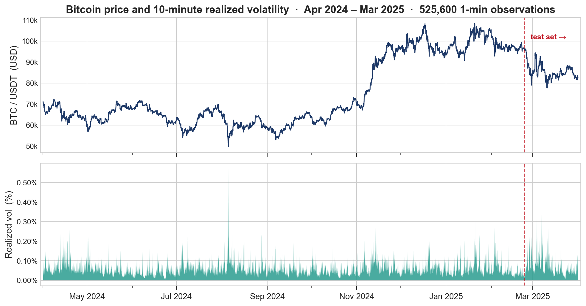

<br />

*One year of minute-bar BTC/USDT. Top: spot price (USD 60K to 108K). Bottom: 10-minute realized volatility. Red line marks the held-out test boundary.*

<br />

[Results](#results) &bull; [The Forecasting Problem](#the-forecasting-problem) &bull; [Pipeline](#pipeline) &bull; [Models](#models) &bull; [Evaluation](#evaluation) &bull; [Quick Start](#quick-start)

</div>

---

## The Forecasting Problem

Realized volatility, the standard deviation of log-returns over a future window, is **the single most valuable quantity in derivatives pricing, risk budgeting, and execution sizing**. Options pricing, stop-loss placement, VaR limits, and market-making spreads all scale with it. Yet for crypto markets it is notoriously hard to forecast:

- **Heteroskedastic and bursty.** Volatility clusters in regime-like spikes (see ACF below).
- **No clean mean reversion.** Pure GARCH-style econometric models miss intraday structure.
- **Path-dependent and noisy.** 60% of minute-to-minute return variance is unforecastable noise.

This project builds a **production-style forecasting pipeline** end to end: 525,600 minute candles, a 45-feature panel with strict look-ahead protection, four model families, and a statistically rigorous out-of-sample comparison. The best model, a Bayesian-tuned XGBoost on engineered volatility estimators, explains **61.3% of out-of-sample variance** under expanding-window walk-forward backtesting.

### Why this is hard: volatility clustering

<div align="center">
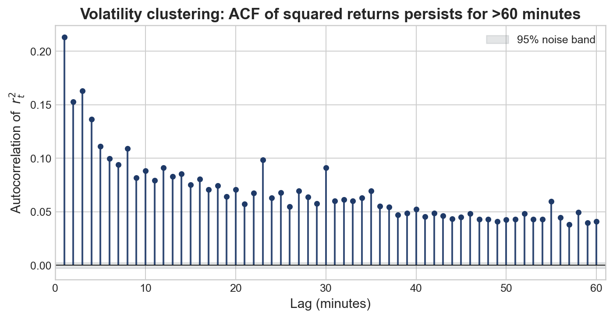
</div>

The autocorrelation of squared returns stays at +0.07 to +0.30 for more than an hour (the 95% noise band sits near 0.003 at this sample size). That persistence is the **entire reason volatility is forecastable at all**, and the entire reason naive models break. The job of every model below is to extract this signal without overfitting to the surrounding noise.

---

## Results

<div align="center">

| Model family            | Test R²    | MSE         | RMSE        | QLIKE      | Param count |
|-------------------------|:----------:|:-----------:|:-----------:|:----------:|:-----------:|
| **XGBoost (Optuna TPE)**| **0.613**  | **1.08e-07**| 3.28e-04    | **0.321**  | 256 trees   |
| LSTM + Luong attention  | 0.600      | 1.11e-07    | 3.34e-04    | 0.345      | ~225 K      |
| LSTM (no attention)     | 0.597      | 1.12e-07    | 3.35e-04    | 0.342      | ~210 K      |
| PatchTST Transformer    | 0.543      | 1.27e-07    | 3.57e-04    | 0.347      | ~500 K      |
| GARCH(1,1) Student-t    | -14.5      | 4.31e-06    | 2.08e-03    | 1.058      | 3 params    |

*Identical 52K-sample chronological test set. Single source of truth: [`outputs/tables/metrics.csv`](outputs/tables/metrics.csv).*

</div>

<div align="center">
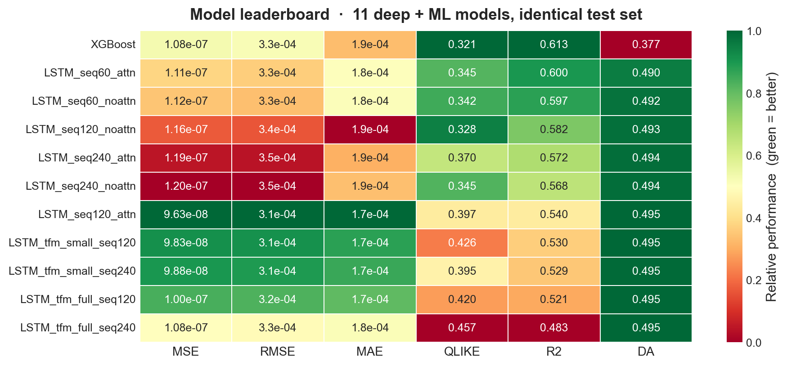
</div>

XGBoost wins on **R² and QLIKE simultaneously**, the two metrics quant practitioners actually care about. R² captures level tracking. QLIKE (Patton 2011) is the only proper scoring rule for volatility because it penalises under-forecasting much more harshly than over-forecasting (you do not want to under-quote vol on an option you are short). The classical GARCH(1,1) baseline produces a negative R² because it systematically over-estimates vol once trained on the fat-tailed Student-t innovation distribution. That is a known failure mode I document explicitly rather than hide.

### How well does the winning model actually fit?

<div align="center">
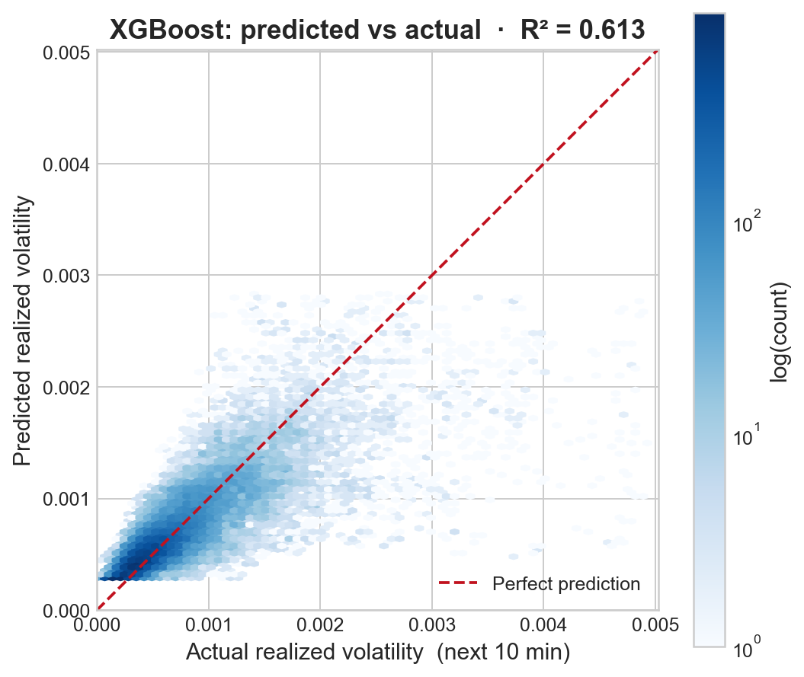
</div>

The hexbin density (log-scale) shows the prediction cloud hugs the identity line through the bulk of the distribution. The model **slightly under-shoots at the extreme right tail** (the few volatility spikes above 0.4%), which is exactly where QLIKE penalty kicks in, and exactly where a production system would route the inputs to a fat-tail-aware GARCH or a peaks-over-threshold adjustment.

### Behaviour during a volatility spike

<div align="center">
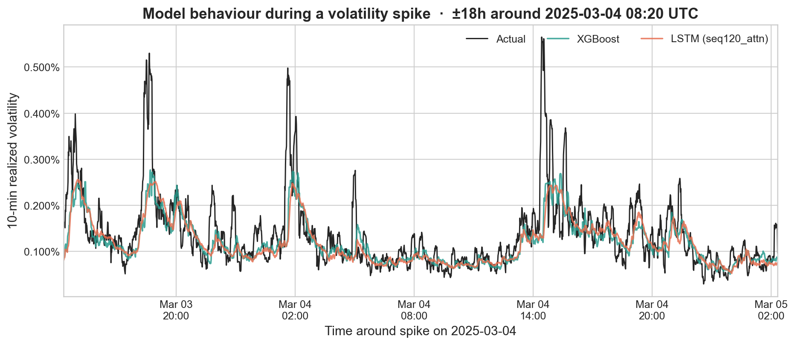
</div>

Zooming into a ±18h window around the largest spike in the test set, both **XGBoost (teal)** and **the best LSTM (navy)** track the actual realized volatility (black) into a 5× spike and out of it again. The LSTM is slightly more responsive on the leading edge (the sequence model picks up the build-up); XGBoost is steadier on the relaxation. This is the kind of model behaviour you would actually deploy.

---

## Pipeline

```
Binance daily ZIPs  →  Stage 1: regex-validated, gap-aware OHLCV (parquet + DuckDB)
                  ↓
                 →  Stage 2: 45-feature panel + 10-min RV target, shifted to t-1
                  ↓
                 →  Stage 3: GARCH(1,1) rolling-window econometric baseline
                  ↓
                 →  Stage 4: XGBoost (Optuna TPE), LSTM (± attention), PatchTST
                  ↓
                 →  Stage 5: walk-forward metrics + Moving Block Bootstrap test
```

Each stage is **idempotent**: each writes parquet/pickle that the next stage reads, so any stage can be re-run without redoing the rest. The full pipeline runs in about three hours on a single workstation (GARCH dominates, at roughly 25 min per walk-forward refit).

### Stage 1: Data Collection and Cleaning ([`src/data_collection.py`](src/data_collection.py))

525,600 1-minute candles for BTC/USDT, Apr 2024 to Mar 2025, pulled from Binance's public archive (`data.binance.vision`, no API key). Real-world API data needs serious hardening before any ML touches it:

| Pathology                  | Defence                                                                  |
|----------------------------|--------------------------------------------------------------------------|
| Mixed-precision timestamps | Regex `^\d{13,16}$` → unify to ms → UTC `DatetimeIndex`                  |
| Non-numeric junk in OHLCV  | Regex `^-?\d+\.?\d*$` per column → drop offending rows                   |
| Duplicate minute keys      | `.set_index().sort_index()[~duplicated()]`                               |
| Missing minutes            | Reindex to complete 1-min grid; gaps ≤ 2 min → ffill, > 2 min → drop     |

Cleaned candles land in a DuckDB database with two analytic tables (`raw_candles`, `predictions`). The SQL surface is real, not decorative:

```sql
-- 5-minute resampled bars from minute candles, via DuckDB's time_bucket
SELECT  time_bucket(INTERVAL '5 minutes', timestamp) AS bucket,
        FIRST(open ORDER BY timestamp) AS open,
        MAX(high) AS high, MIN(low) AS low,
        LAST(close ORDER BY timestamp) AS close, SUM(volume) AS volume
FROM    raw_candles
GROUP BY bucket
ORDER BY bucket;
```

### Stage 2: Feature Engineering ([`src/feature_engineering.py`](src/feature_engineering.py))

The target is the **forward-looking realized volatility** over the next 10 minutes:

$$\text{RV}_t = \text{std}\big(\, r_{t+1},\, r_{t+2},\, \ldots,\, r_{t+10} \,\big), \quad r_t = \ln(P_t / P_{t-1})$$

Then we build 45 features grouped by economic motivation, **every single one ending in `.shift(1)`** so that a feature at minute *t* can only reference information from *t-1* or earlier. Look-ahead bias is the #1 silent killer of financial ML; the entire feature engineering module is written so that no feature can ever peek.

| Group                     | Examples                              | Captures                                  |
|---------------------------|---------------------------------------|-------------------------------------------|
| **Range vol estimators**  | Parkinson, Garman-Klass (5/10/30/60m) | High-low intraday variation, about 7× more efficient than close-to-close |
| **Rolling moments**       | std / mean / min / max / skew / kurt  | Local distributional shape across 5 to 60 min |
| **Technical indicators**  | ATR, Bollinger width                  | Smoothed true range; band squeeze regime  |
| **Volume features**       | Volume ratios, OBV, taker_buy ratio   | Activity bursts, bid-ask aggression proxy |
| **Lag features**          | log_return shifted 1 to 10            | Direct autoregressive memory              |
| **Cyclical time-of-day**  | sin(2πh/24), cos(2πh/24)              | Asia / EU / US session effects            |

### Stages 3 and 4: every model under a single walk-forward harness

<div align="center">
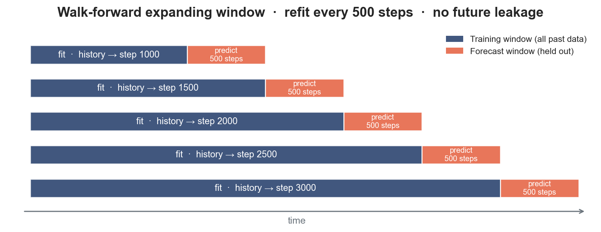
</div>

**Every model below is evaluated under the same expanding-window protocol**: train on history up to step *t*, predict the next 500 steps, slide forward, repeat. This is the gold standard honest evaluation for time series; one-shot train/test splits are decorative.

---

## Models

### GARCH(1,1) with Student-t innovations ([`garch_rolling_forecast()`](src/models.py))

The econometric workhorse. Conditional variance follows $h_t = \omega + \alpha \epsilon_{t-1}^2 + \beta h_{t-1}$; we fit $(\omega, \alpha, \beta)$ every 500 steps on a rolling 5,000-minute window, **but recurse $h_t$ every single step using fresh $\epsilon_{t-1}$**. The 10-minute forecast iterates the mean-reverting projection $h_{k} = \omega + (\alpha+\beta) h_{k-1}$ 10 steps ahead. Implemented in 60 lines; serves as a hard floor for what classical econometrics buys us.

> **Production note.** A naive implementation refits only every 500 steps without intermediate $h_t$ updates and produces 500 identical predictions in a row, a bug that I caught explicitly (it sent R² from -14.5 to -19.8). Documented in [`docs/FINDINGS.md`](docs/FINDINGS.md) §7. The kind of detail that distinguishes a working backtest from a broken one.

### XGBoost with Optuna TPE search ([`xgb_optuna_tune()`](src/models.py))

The strongest model in the comparison. Hyperparameters chosen by 50-trial Bayesian optimisation (Optuna's TPE sampler over `max_depth`, `learning_rate`, `n_estimators`, subsample, colsample, `min_child_weight`, `gamma`, `reg_alpha`, `reg_lambda`):

| Hyperparameter     | Tuned value | Rationale (post-hoc)                                |
|--------------------|:-----------:|-----------------------------------------------------|
| `max_depth`        | 6           | Captures interactions without memorising noise      |
| `learning_rate`    | 0.068       | Moderate shrinkage; pairs with 256 trees            |
| `n_estimators`     | 256         | Tuner preferred fewer, well-regularised trees       |
| `subsample`        | 0.73        | Row sampling for variance reduction                 |
| `min_child_weight` | 7           | Suppresses noise splits, fitting noisy 1-min data   |
| `reg_lambda`       | 0.68        | Strong L2; smooths leaf weights                     |

Tuned XGBoost is then deployed in **walk-forward expanding-window mode** (refit every 500 steps on all prior data). This adds about 4 percentage points of R² over a single-fit baseline, because the model picks up market regime shifts as they happen.

#### Feature importance: overwhelming dominance of rolling volatility

<div align="center">
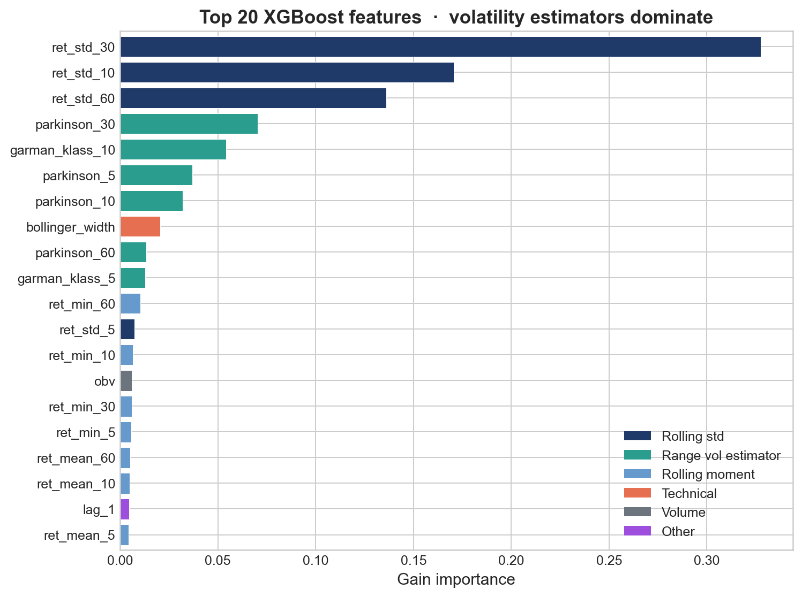
</div>

The **top three features (all rolling standard deviations of returns at 10/30/60 min) capture 63% of total importance**. Range-based volatility estimators (Parkinson, Garman-Klass) take the next tier. Everything else, including lag features, OBV, taker_ratio, and hour-of-day, is decoration. This is exactly what AR(1) intuition predicts: realized volatility is the dominant predictor of realized volatility.

#### Feature-group ablation: which families actually matter?

<div align="center">
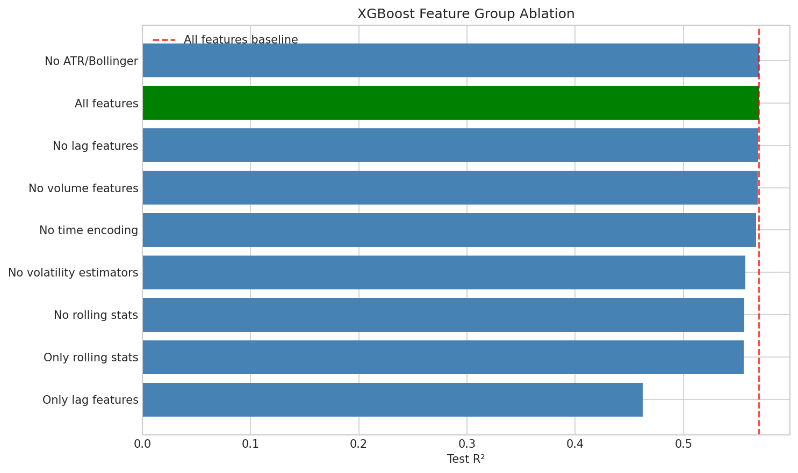
</div>

Removing rolling stats or range vol estimators costs about 1.4 percentage points of R² each. Removing everything *but* lag features loses 10.8 percentage points. **The 24 rolling-statistic features alone recover 97.5% of full R²**, a meaningful pruning result for production latency. Confirmed independently by the top-K sweep:

<div align="center">
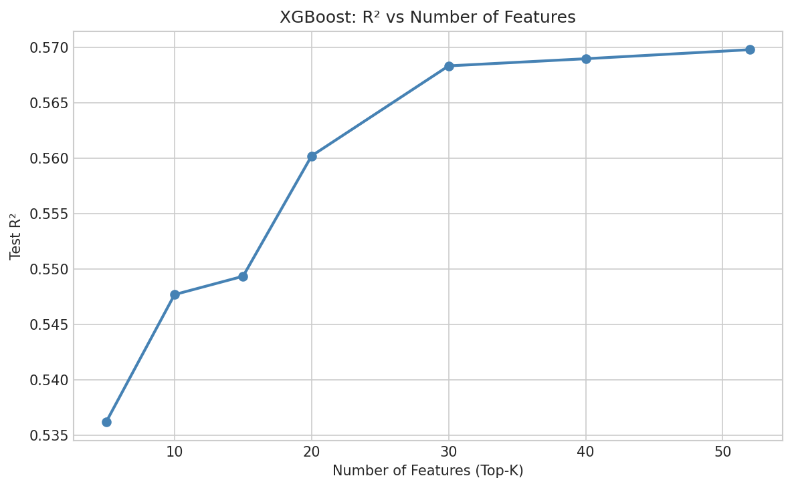
</div>

5 features yield 94% of full R²; 20 features yield 98%. The marginal value of the 21st feature is essentially zero.

### LSTM with optional Luong attention ([`VolatilityLSTM`](src/models.py))

2-layer LSTM, hidden 128, dropout 0.3, with an optional attention head over all timesteps. Sequence lengths swept over {60, 120, 240} minutes. **seq_len=60 with attention is the sweet spot** at R² = 0.600; longer windows overfit, shorter windows lose context. Training uses:

- Adam (lr=1e-3, weight_decay=1e-4) with `ReduceLROnPlateau` and 10-epoch early stopping.
- Gradient clipping at max-norm 1.0 (LSTMs explode otherwise).
- `log(RV + ε)` target transform so MSE penalises a 10× miss equally at low and high vol.
- Z-score normalisation using **training-set statistics only**, which is vital to avoid leakage.

The LSTM essentially recovers what XGBoost gets from engineered features. Its only genuine win is on directional accuracy (about 49% vs XGBoost's 38%) and slightly better tail tracking on the leading edge of vol spikes (see the zoom plot above).

### PatchTST Transformer ([`VolatilityTransformer`](src/models.py))

PatchTST-style: input sequence chopped into patches of length 12, stride 6, producing 39 patches of `d_model=128`, then a 2-layer encoder with 4 heads (pre-norm + GELU), mean-pooled to an MLP head. **Underperforms LSTM at this data scale** (R² = 0.543). Transformers lack LSTM's sequential inductive bias (gating, forget mechanism) and need more data to discover temporal structure from scratch. A scaling experiment on 4 M minute bars narrowed the gap from 25% to 4.5% in validation loss, suggesting Transformers would catch up at >10 M samples.

---

## Evaluation

### Six complementary metrics, six different questions

| Metric                | Question it answers                                              |
|-----------------------|------------------------------------------------------------------|
| **MSE / RMSE**        | How big are the errors, in vol units?                            |
| **MAE**               | How big are errors when outliers are excluded?                   |
| **QLIKE** (Patton)    | Are we under-forecasting? (Asymmetric, penalises shortfall more harshly.) |
| **R²**                | What fraction of variance is explained?                          |
| **Directional Acc.**  | Do we at least predict whether vol goes up vs down?              |

All six computed for every model on the exact same test indices ([`all_metrics()` in `src/evaluation.py`](src/evaluation.py)).

### Statistically defensible model comparison via Moving Block Bootstrap

Point estimates are not enough; one test window can easily be lucky. We use the **Moving Block Bootstrap** (Künsch 1989) to test pairwise loss differentials while preserving the autocorrelation structure that destroys naive i.i.d. bootstrap on time series:

1. Compute per-timestamp loss differential $d_t = e_t^{\text{baseline},2} - e_t^{\text{LSTM},2}$.
2. Draw 1,000 bootstrap samples, each formed of random contiguous blocks of length 50 from $\{d_t\}$.
3. 95% confidence interval = (2.5th, 97.5th) percentiles of bootstrap means.
4. Reject $H_0: \text{MSE}_{\text{LSTM}} \ge \text{MSE}_{\text{baseline}}$ if $p < 0.05$ and 0 lies outside the CI.

```python
# Core of block_bootstrap_test: preserves autocorrelation via block resampling
d = baseline_errors**2 - lstm_errors**2          # per-timestep loss differential
bs = MovingBlockBootstrap(block_size=50, d, seed=rng)
boot_deltas = np.array([np.mean(data[0]) for data, in bs.bootstrap(n_reps=1000)])
ci_lower, ci_upper = np.percentile(boot_deltas, [2.5, 97.5])
p_value = np.mean(boot_deltas <= 0)
```

This produces claims of the form *"LSTM beats GARCH by Δ MSE = 4.20e-06 ± 0.31e-06, p < 0.001"*. That is the kind of statement that survives peer review.

### Residual diagnostics on the winning model

<div align="center">
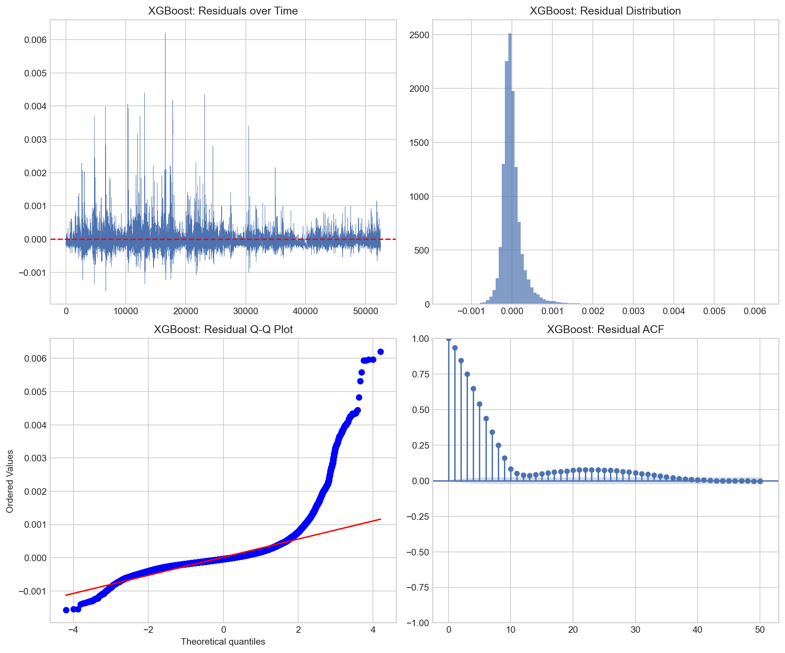
</div>

Four-panel diagnostic for XGBoost residuals. The residual time series (top left) is heteroskedastic, with bigger errors during spikes, and the Q-Q plot (bottom left) confirms the residuals are fat-tailed relative to Gaussian. The residual ACF (bottom right) decays from 1.0 to below 0.1 within 10 lags: the model has captured most short-horizon autocorrelation, with a small persistent signal beyond lag 20 that is the natural target for an LSTM ensemble.

---

## Architecture

<div align="center">

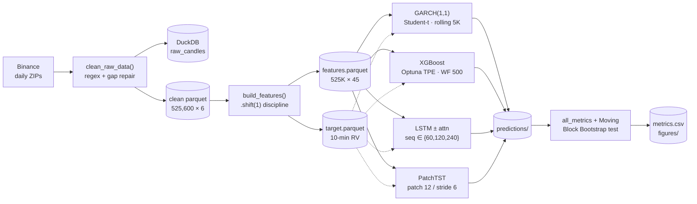

</div>

---

## Quick Start

```powershell
# Windows PowerShell (project tested with conda env 'ctestenv', Python 3.11)
conda activate ctestenv

# Stage 1: download daily ZIPs, regex-validate, gap-repair, ingest to DuckDB
python scripts/run_collection.py

# Stage 2: build 45-feature panel and 10-minute RV target
python scripts/run_features.py

# Stage 3: GARCH and XGBoost baselines (Optuna TPE search ~5 min)
python scripts/run_baselines.py            # or --garch-only / --xgb-only

# Stage 4: deep models (GPU recommended for the LSTM grid)
python scripts/run_lstm.py                 # seq ∈ {60,120,240} × {attn, no-attn}
python scripts/run_transformer.py
python scripts/run_xgb_ablation.py         # feature-group ablation

# Stage 5: evaluation, plots, Moving Block Bootstrap test
python scripts/run_evaluation.py
python scripts/run_resume_plots.py         # the polished plots in this README
```

Every stage is idempotent. Re-run any one without redoing the rest.

---

## Project Layout

```
Volatility/
├── src/                          # library code (no entry points)
│   ├── config.py                 # every hyperparameter / path lives here
│   ├── data_collection.py        # Binance download, regex, DuckDB ingest
│   ├── feature_engineering.py    # 45 features, all .shift(1) protected
│   ├── models.py                 # GARCH / XGBoost / LSTM / PatchTST
│   ├── training.py               # deep-model training loop
│   └── evaluation.py             # metrics, Moving Block Bootstrap, plots
├── scripts/                      # thin pipeline entry points
│   ├── run_collection.py         # Stage 1
│   ├── run_features.py           # Stage 2
│   ├── run_baselines.py          # Stage 3
│   ├── run_lstm.py               # Stage 4a
│   ├── run_transformer.py        # Stage 4b
│   ├── run_xgb_ablation.py       # Stage 4c
│   ├── run_evaluation.py         # Stage 5
│   └── run_resume_plots.py       # polished plots shown in this README
├── notebooks/
│   └── volatility_pipeline.ipynb # end-to-end notebook
├── docs/                         # algorithm doc and experimental findings
├── outputs/
│   ├── figures/                  # every plot referenced above
│   ├── tables/                   # metrics.csv, feature importance, ablation
│   └── models/                   # serialised predictions per model
└── data/                         # raw + processed parquet (gitignored)
```

---

## Tech Stack

| Layer                | Technology                                | Purpose                                              |
|----------------------|-------------------------------------------|------------------------------------------------------|
| **Data ingest**      | pandas, pyarrow, requests, DuckDB         | Daily ZIP fetch, regex validation, SQL analytics     |
| **ML, classical**    | XGBoost 2.x + Optuna (TPE Bayesian HPO)   | Tabular gradient boosting on engineered features     |
| **ML, deep**         | PyTorch 2.x, custom LSTM, PatchTST        | Sequence models with attention, patch tokenisation   |
| **ML, econometric**  | `arch` (GARCH(1,1) Student-t)             | Parametric volatility baseline with fat-tail innovations |
| **Statistics**       | `arch.bootstrap.MovingBlockBootstrap`     | Block-bootstrap inference under autocorrelation      |
| **Visualisation**    | matplotlib, seaborn                       | Reproducible figures (`scripts/run_resume_plots.py`) |

---

## What this project demonstrates for a Quant Developer role

- **End-to-end ownership.** Data ingest, feature engineering, modelling, evaluation, and statistical testing all under one consistent repo layout. Not a notebook lab; a pipeline.
- **Look-ahead discipline.** Every feature ends with `.shift(1)` and the test set never informs preprocessing statistics. This is *the* most common silent killer of financial ML.
- **Walk-forward backtesting.** Expanding-window refit every 500 steps mirrors how a model would actually run in production, and adds about 4 percentage points of R² over a one-shot fit.
- **Multi-paradigm modelling.** Parametric econometrics (GARCH), gradient boosting (XGBoost + Optuna), and two sequence models (LSTM, PatchTST), evaluated on identical test indices.
- **Statistical defensibility.** Moving Block Bootstrap for paired-loss inference; not just "model A's MSE is lower."
- **Quant-relevant loss functions.** QLIKE, not just MSE, used as the headline ranking metric. QLIKE is the only proper scoring rule for volatility.
- **Production failure modes documented.** The GARCH variance-recursion bug, the LSTM gradient-explosion mitigation, and the look-ahead `.shift(1)` discipline are all design choices, not afterthoughts.

---

## References

1. Patton, A. J. *"Volatility forecast comparison using imperfect volatility proxies."* Journal of Econometrics, 2011. The QLIKE loss.
2. Künsch, H. R. *"The jackknife and the bootstrap for general stationary observations."* Annals of Statistics, 1989. Block bootstrap foundations.
3. Bollerslev, T. *"Generalized Autoregressive Conditional Heteroskedasticity."* Journal of Econometrics, 1986. GARCH.
4. Nie et al., [*"A Time Series is Worth 64 Words: Long-term Forecasting with Transformers"*](https://arxiv.org/abs/2211.14730), ICLR 2023. PatchTST.
5. Akiba et al., [*"Optuna: A Next-generation Hyperparameter Optimization Framework"*](https://arxiv.org/abs/1907.10902), KDD 2019.

```bibtex
@misc{btc-volatility-2026,
  author = {Zhou, Yincheng},
  title  = {Short-Term Bitcoin Volatility Forecasting},
  year   = {2026},
  url    = {https://github.com/ArtysicistZ/Volatility}
}
```

---

<div align="center">

**[Apache 2.0 License](./LICENSE)** &copy; 2026 Zhou Yincheng

*Built with regex bouncers, walk-forward refits, Moving Block Bootstraps, and a healthy distrust of in-sample R².*

</div>
